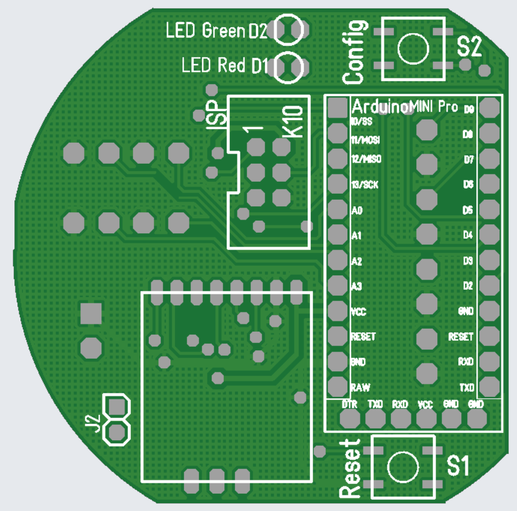
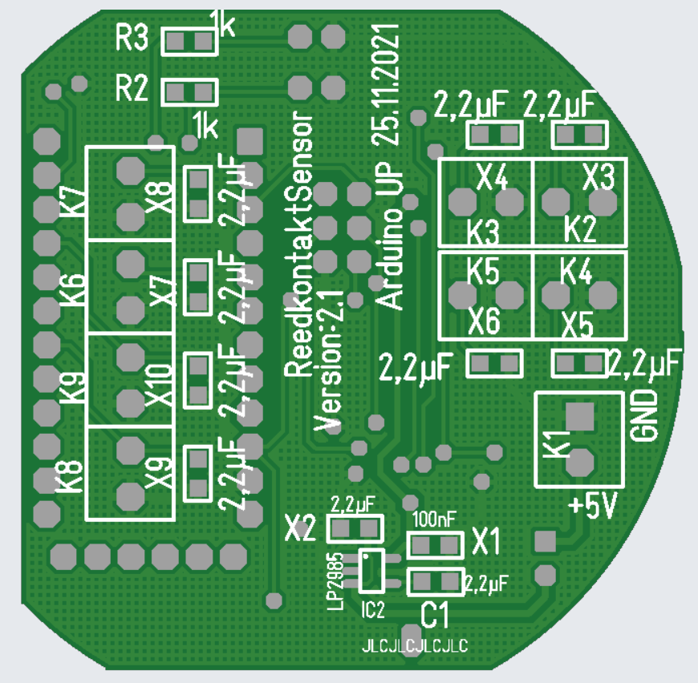
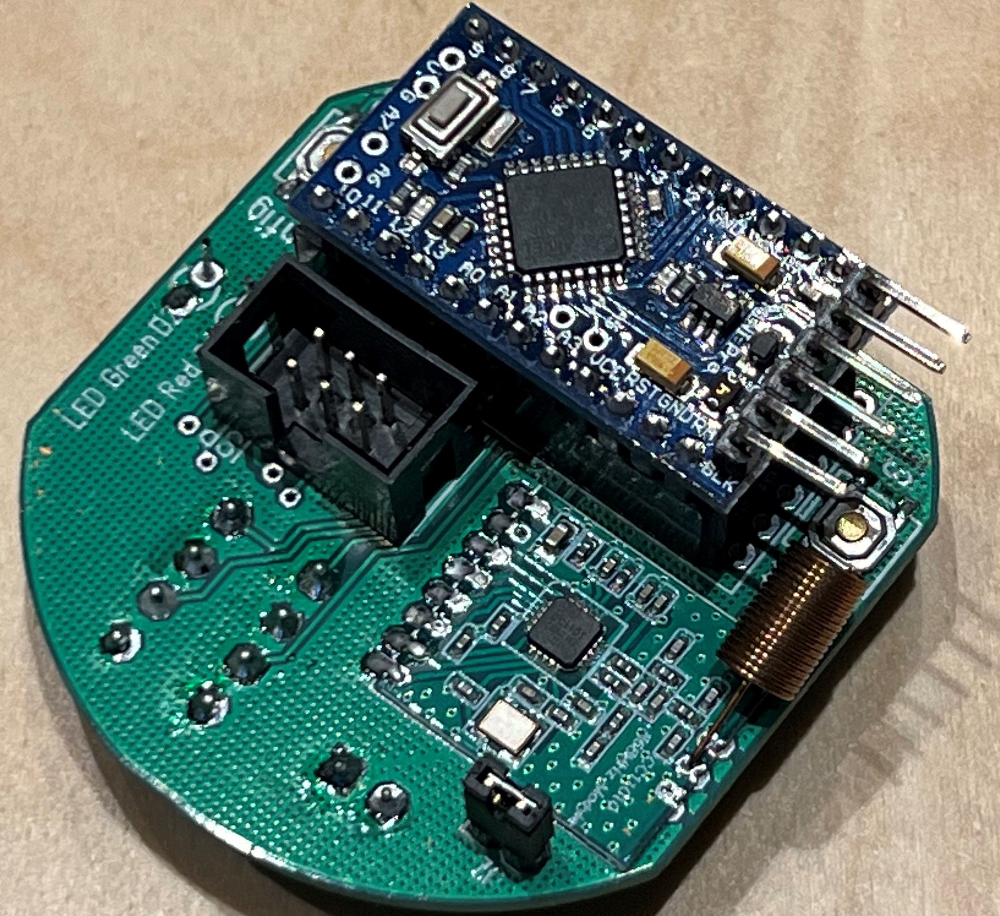
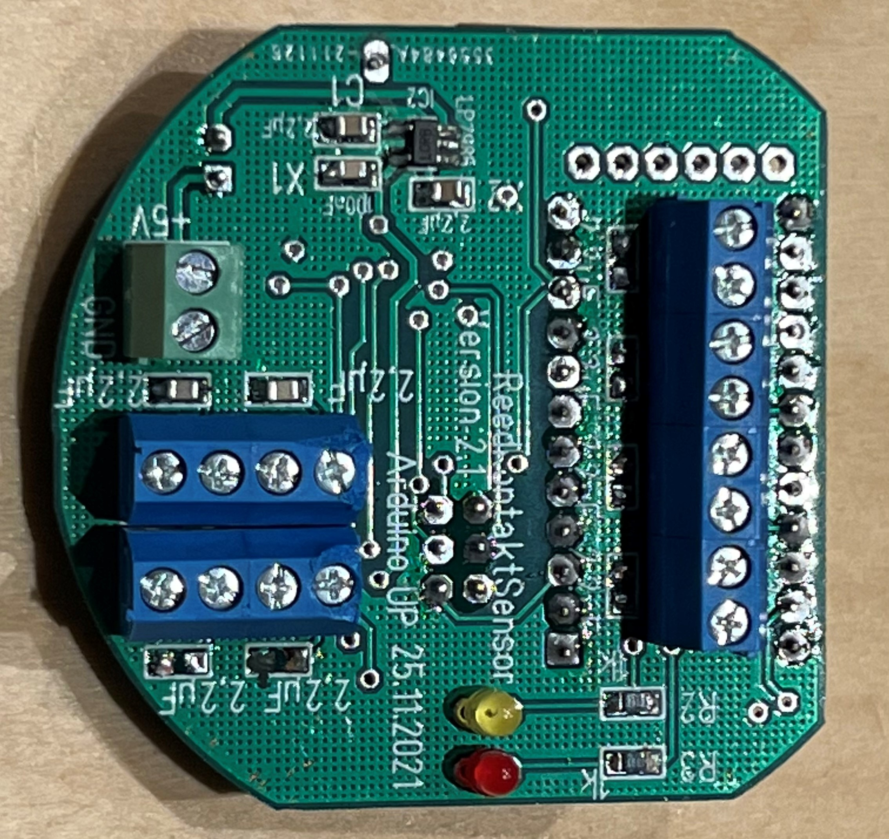

# WindowStatusSensor in der ATMega Version als Homematic Gerät
Magels Verfügbarkeit von Panstamps NRG´s ist diese AtMega auf Basis eines ATMega Mini´s entstanden. Als Firmware wird die AskSinPP Library verwendet. Das Gerät identifiziert sich als HB-SEC-RHS-4x. Zur Einbindung in FHEM ist eine Anpassung der HM_Config notwendig.

Platine Vorderseite              |  Platine Rückseite             | Fertig aufgebaut Vorderseite      | Fertig aufgebaut Rückseite
:-------------------------------:|:------------------------------:|:---------------------------------:|:-----------------------------
  |  |  | 

## Firmware vorbereiten
Als erstes ist es angeraten, einen Frequenztest des verbauten CC1101 durchzuführen. Manche CC1101 Module haben einen leicht verschobenen Frequenzbereich. Das kann dazu führen das ein schlechter bis hin zu kein Empfang möglich ist. Um den Frequenztest durchzuführen bitte hier lesen: [Ermittlung der CC1101 Frequenz](https://asksinpp.de/Grundlagen/FAQ/Fehlerhafte_CC1101.html#ermittlung-der-cc1101-frequenz).  

Im Verzeichnis "Firmware" liegt schon eine fertige Binärdatei die mir avrdude geflashed werden kann:

    avrdude -p m328p -c stk500v2 -P /dev/ttyUSB0 -V -U flash:w:Firmware/FreqTest.ino.with_bootloader.hex

Nach Abschluss der Übertragung des Freqtest Sketches, muss der AVR über die serielle Konsole beobachtet werden. Nach Abschluss des Test wird die passende Frequenz in der Konsole angezeigt, zb: <code>0x2165C2</code>  
Diese Frequenz in Hex (hier: 2165C2) muss sich für den nachfolgenden Schritt gemerkt werden. 

## Bootloader und Firmware flashen
Wenn man die fertige Firmware (-> Ordner Firmware) benutzen möchte, muss diese nun mit einem Bootloader versehen werden. Das Flag <code>#define USE_OTA_BOOTLOADER</code> ist bereits dort gesetzt. Gleichzeitig müssen die grundlegenden Homematic ID´s vergeben werden. Bitte dazu wie hier (-> [Asksin Bootloader erstellen](https://asksinpp.de/Grundlagen/02_software.html#bootloader-erstellen)) vorgehen. Die zuvor gemerkte korrekt CC1101 Frequenz muss hier ebenfalls eingetragen werden.   

Folgende Einstellungen sind vorzunehmen:

| Einstellung | Wert     |
|:----------- |:-------- |
| MCU Type    | ATmega328|
| Device Model| F20E     |
| HM-ID       | eindeutig, zb.: F20E00 |
| HM-Serial   | eindeutig, zb.: papaf20e00 |
| CC1101 Frequence Settings | der oben ermittelte Wert, zb.: 2165C2 |
| Config String | 0 |

Dann die OTA Firmware (-> Firmware_ohne_Bootloader.hex) aus dem Firmware Verzeichnis laden und anschließend mittels BUtton "Create Bootloader" die Firmware mit Bootloader erstellen lassen.  
Anschließend die so generierte Firmware mittels **MySmartUSB light** oder jedem anderern **AVR ISP Programmer** flashen. Siehe auch hier: [Asksin Firmware flashen](https://asksinpp.de/Grundlagen/02_software.html#bootloader-flashen)

    avrdude -p m328p -c stk500v2 -P /dev/ttyUSB0 -U lfuse:w:0xE2:m -U hfuse:w:0xD0:m
    avrdude -p m328p -c stk500v2 -P /dev/ttyUSB0 -V -U flash:w:ASKS21001.hex

## Sensoren anschließen
Folgende Klemmen sind auf den Platinen auf die folgenden 4 Channels gemappt:  

| Klemme | Kanal |
|:------:|:-----:|
| K7 | Channel 01|
| K6 | Channel 01|
| K8 | Channel 02|
| K9 | Channel 02|
| K3 | Channel 03|
| K2 | Channel 03|
| K4 | Channel 04|
| K5 | Channel 04|