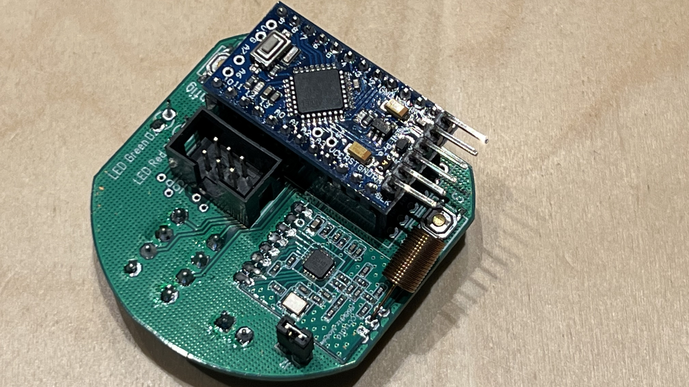

# WindowStatusSensor in der ATMega Version als Homematic Gerät
Magels Verfügbarkeit von Panstamps NRG´s ist diese AtMega auf Basis eines ATMega Mini´s entstanden. Als Firmware wird die AskSinPP Library verwendet. Das Gerät identifiziert sich als HM-SEC-RHS-4x. Zur Einbindung in FHEM ist eine Anpassung der HM_Config notwendig.

Platine Vorderseite              |  Platine Rückseite             | Fertig aufgebaut Vorderseite      | Fertig aufgebaut Rückseite
:-------------------------------:|:------------------------------:|:---------------------------------:|:-----------------------------
  |  |  | 
